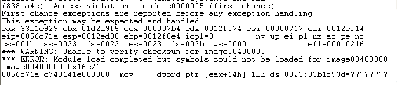

Cool PDF Reader SEH Overwrite
-----------------------------

I decided to set up a simple fuzzer against a relatively unknown product to find my first 0 day in the wild. I found a PDF reader called "Cool PDF Reader" and later found that metasploit has a module for an older version. The version I used is 3.1.6.308.

### The Crash
After fuzzing for an hour or so I started looking through the crashes. A lot of them didn't look interesting like null pointer dereferences, but one of them was trying to dereference an address that looked a lot like file data: 0x33b1c93d

!exchain showed me that I had ran over an exception handler. Could exploitation really be this easy? !nmod showed me that DEP and SAFESEH were not enabled. I used a simple pointer to POP POP RET and jump 06 bytes and used metasploits windows/exec CMD=calc.exe to pop calc within a few hours of starting my fuzzer. Wow felt great.

### Root Cause Analysis
The vulnerable function assigns a 300 byte buffer (at address 0x0056C47A assuming it's loaded in 0x400000). Cool PDF Reader uses a byte in the file to point to 16 bytes in the file that get added up and stored in a local variable. That local variable is used to determine how many bytes will be read off the file and onto the stack. If you make those bytes add up to 114h or 276d you will overwrite eip with the saved return address and gain control that way. I did this by making 14 null bytes and then FF and 15 (FFh + 15h = 114h).

My fuzzer changed the original pointer byte of 01 to 39 so it started reading bytes from a location in the file 38 bytes further than normal. These new 16 bytes totaled a much higher number than Cool PDF was expecting (7b4h to be exact) and continued to write past the buffer and all the way into into the seh chain. It turns out that the pointer is not the root cause. The root cause is allowing those 16 bytes to add to any value especially up to 114h.

I do not know what these bytes are responsible for in the PDF specifications but the 16 bytes can be found at offset 0x600C to 0x601B in the malicious file I included on my github,  [CoolPDFReader_316308.pdf](CoolPDFReader_316308.pdf)

Andrew Lewis